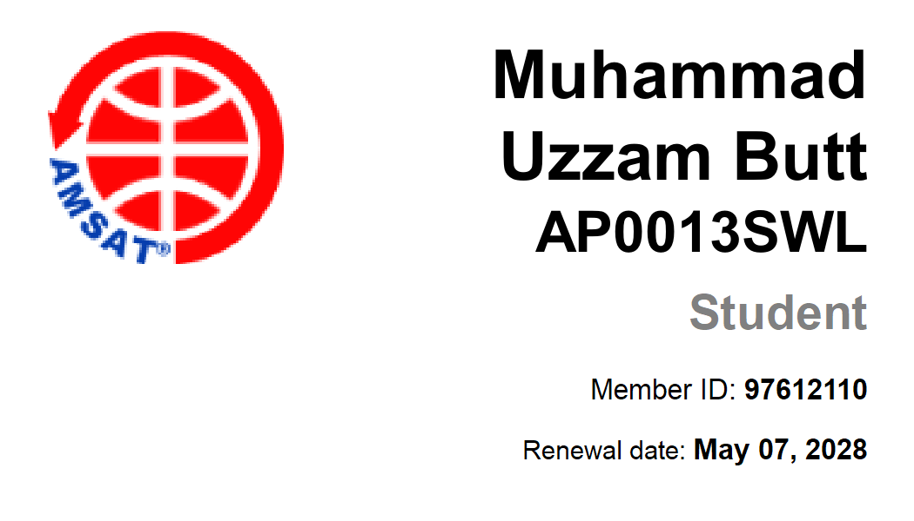

<div align="center">



<br/><br/>

# MUHAMMAD UZZAM BUTT

**FPGA Dev Boards &nbsp;·&nbsp; RF &amp; GNSS &nbsp;·&nbsp; ESP32 Firmware**


<br/>

<a href="https://northernstudios.cc"></a>
<a href="https://www.linkedin.com/in/muhammad-uzzam-butt-ba831a258"></a>
<a href="mailto:uzzambutt1@outlook.com"></a>
<a href="https://discord.gg/7ss3nA5dK5"></a>

</div>

---

## ▸ What I Build

```text
FPGA     custom dev boards · Verilog/VHDL RTL · timing closure · high-speed IO
RF       front-ends · LNAs · matching networks · antennas · SDR bench work
GNSS     GPS receiver chains · NMEA & raw observables · PPS timing discipline
ESP32    ESP-IDF firmware · FreeRTOS · BLE/Wi-Fi/LoRa · deep-sleep power budgets
PCB      multilayer layout · impedance control · DFM · bring-up & debug
```

<table>
<tr>
<td width="50%" valign="top">

**Current focus**

- Open-hardware FPGA development board
- RF + GNSS receiver characterisation
- Low-power ESP32 telemetry nodes

</td>
<td width="50%" valign="top">

**Interests**

- Amateur satellite comms (AMSAT)
- Signal chains, phase noise, SDR
- Deterministic embedded systems

</td>
</tr>
</table>

---

## ▸ Stack

```text
Design     KiCad · Fusion360 · EasyEDA
Firmware   C · C++ · ESP-IDF · FreeRTOS · STM32 · PlatformIO
RF         GNU Radio · SDR · LoRa · GPS · MQTT
Analysis   Python · NumPy · Matplotlib
Tools      Git · CMake · Linux · GitHub Actions
Hardware   FPGA · RaspberryPI· STM32 · ESP32
```

---

## ▸ Activity

<div align="center">

[](https://github.com/uzzambutt)
[](https://github.com/uzzambutt)

<br/>

[](https://rankistan.dev)

</div>

---

<div align="center">
<sub>signals in, bitstreams out</sub>
</div>
